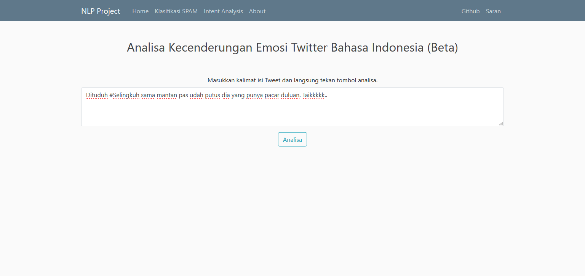

# Purwadhika Job Connector Data Science - Final Project #

## SPAM filter and Tweet Emotion Analysis Web App ##

This repository contain the final project as one of the requirements to fullfill in [Purwadhika](https://purwadhika.com/jc-data-science) Job Connector - Data Science Program. Theme of this project is to create web based app and using [Natural Language Processing](https://en.wikipedia.org/wiki/Natural_language_processing) procedures to create app that can classify [SMS](https://en.wikipedia.org/wiki/SMS) as SPAM, Promotion, or Normal and also app that can classify the emotion (happy, angry, sad, fear, love) from tweet from [Twitter](https://twitter.com/).  
Dataset used to make this project are:

1. [Indonesia SMS Spam Filter Dataset](http://nlp.yuliadi.pro/dataset).

2. [Indonesian Twitter Emotion Dataset](https://github.com/meisaputri21/Indonesian-Twitter-Emotion-Dataset).

The python libraries used to make this project are:

- pandas
- numpy
- matplotlib
- seaborn
- io
- flask_mysqldb
- base64
- scikit-learn
- joblib

Several machine learning are used and compared to evaluate the model. From model evaluation, the **machine learning** algorithms I used for model for this app are:

- Stochastic Gradient Descent Classifier - [SGDC](https://scikit-learn.org/stable/modules/generated/sklearn.linear_model.SGDClassifier.html) for SPAM filtering app.

- Multinomial Naive Bayes - [MultinomialNB](https://scikit-learn.org/stable/modules/generated/sklearn.naive_bayes.MultinomialNB.html) for twitter emotion detection app.

For details explanation can be looked at [dataset_and_notebook](dataset_and_notebook).

The components for this web app can be summarized as several section:

1. **Homepage**  

2. **Klasifikasi SPAM**  
  
  
  

3. **Tweet Analysis**  
  
  
  

4. **Saran/Suggestion Box**  
  
  

5. **About Page**  

Thats all for this final project, feel free to **suggest** to **email below** and let me know how can this project make working even better.

### Rudy Aunallah B S | _rudy.abs@live.com_ ###

[Facebook](https://www.facebook.com/rudy.bumisatrio) |
[Twitter](https://twitter.com/rudy_bumi) |
[GitHub](https://github.com/rudyabs) |
[Kaggle](https://www.kaggle.com/rudyabs)
